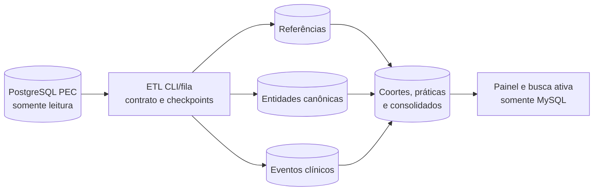

# Arquitetura de Dados do Monitora Fácil

## 1. Objetivo

O MySQL é a base operacional e analítica do Monitora Fácil. O PostgreSQL do e-SUS APS PEC é uma fonte somente leitura, acessada exclusivamente por comandos e filas em segundo plano.

O painel web nunca consulta o PEC. Cada sincronização extrai apenas os campos necessários, normaliza os registros no MySQL e recalcula os produtos analíticos. O desenho deve permitir busca ativa por cidadão, auditoria das regras e reconstrução dos resultados quando uma nota metodológica mudar.

Este documento separa:

1. fatos e dimensões extraídos do DW PEC;
2. entidades canônicas mantidas no MySQL;
3. resultados derivados para indicadores e vigilância;
4. controle técnico das sincronizações.

As tabelas das seções 3 a 6 são o desenho-alvo. As tabelas já existentes estão identificadas na seção 2. Nenhuma tabela proposta deve ser criada antes da inspeção do esquema real disponível na VPS.

## 2. Estado atual

O banco de dados operacional e analítico do Monitora Fácil conta atualmente com **26 tabelas de aplicação** em produção, distribuídas em cinco domínios funcionais (Gestão, Consolidação/APS, Coortes e Busca Ativa C2–C7, Saúde Bucal eSB B1–B6, e Avaliação Territorial/CVAT), além de **8 tabelas técnicas de infraestrutura** gerenciadas pelo Laravel.

### 2.1. Inventário Geral de Tabelas Ativas

| Domínio | Tabela | Modelo Eloquent | Finalidade e Conteúdo |
|---|---|---|---|
| **Gestão e Configuração** | `users` | `User` | Usuários do sistema, perfis e rastreamento da versão visualizada (`last_seen_version`). |
| | `settings` | `Setting` | Configurações chave-valor do município (`city_name`, `ibge_code`, `state_uf`, filtros de CNES/equipes). |
| | `sync_logs` | `SyncLog` | Auditoria detalhada das rotinas de sincronização e ETL (status, tempos de início/fim e mensagens de erro). |
| **Consolidação e Painel APS** | `consolidation_teams` | `ConsolidationTeam` | Quantitativo de equipes ativas por quadrimestre e tipo (`esf`, `esaude_bucal`, `emulti`). |
| | `consolidation_registrations` | `ConsolidationRegistration` | Contagens de cadastros individuais (MICI) e domiciliares (MICDT), atualizados e desatualizados por quadrimestre. |
| | `family_health_indicator_snapshots` | `FamilyHealthIndicatorSnapshot` | Snapshots quadrimestrais consolidados por equipe e indicador (C1 a C7) no Painel Municipal da Saúde da Família. |
| | `family_health_monthly_snapshots` | `FamilyHealthMonthlySnapshot` | Evolução mensal dos indicadores da Saúde da Família por equipe e mês no quadrimestre (ex: demanda programada vs total em C1). |
| **Coortes e Busca Ativa (C2–C7)** | `c2_cohort_snapshots` | `C2CohortSnapshot` | Coorte C2 (crianças de 2 anos) agregada por equipe, tipo de equipe e quadrimestre, com contagens mensais. |
| | `c2_nominal_children` | `C2NominalChild` | Lista nominal com busca ativa de crianças da coorte C2, contato, vínculo e 5 boas práticas (A: 9 consultas, B: antropometria, C: VIP, D: Penta, E: Pneumo-10). |
| | `c3_cohort_snapshots` | `C3CohortSnapshot` | Coorte C3 (gestantes e puérperas) agregada por equipe e quadrimestre. |
| | `c3_nominal_pregnancies` | `C3NominalPregnancy` | Lista nominal com busca ativa de gestantes/puérperas do C3 com DUM, DPP, idade gestacional e 11 boas práticas (A a K: consultas, exames, PA, odonto, vacina dTpa, puerpério). |
| | `c4_cohort_snapshots` | `C4CohortSnapshot` | Coorte C4 (cuidado de pessoas com diabetes) agregada por equipe e quadrimestre, com totais da coorte e avaliados. |
| | `c4_nominal_diabetics` | `C4NominalDiabetic` | Lista nominal com busca ativa de pessoas com diabetes (CIAP/CID), status da condição e 6 boas práticas (Quadro 01: consulta 6m, PA 6m, antropometria 12m, visitas ACS 12m, HbA1c 12m, exame dos pés 12m). |
| | `c5_cohort_snapshots` | `C5CohortSnapshot` | Coorte C5 (cuidado de pessoas com hipertensão) agregada por equipe e quadrimestre. |
| | `c5_nominal_hypertensives` | `C5NominalHypertensive` | Lista nominal com busca ativa de hipertensos (CIAP/CID) e 4 boas práticas (Quadro 01: consulta 6m, PA 6m, antropometria 12m, visitas ACS 12m). |
| | `c6_cohort_snapshots` | `C6CohortSnapshot` | Coorte C6 (cuidado da pessoa idosa 60+ anos) agregada por equipe e quadrimestre. |
| | `c6_nominal_elderly` | `C6NominalElderly` | Lista nominal com busca ativa de idosos com 4 boas práticas (Quadro 01: consulta anual, antropometria anual, visitas ACS 12m, vacina Influenza anual). |
| | `c7_cohort_snapshots` | `C7CohortSnapshot` | Coorte C7 (saúde da mulher) com cumprimento e pontuação dos 4 denominadores/estratos clínicos (colo do útero, HPV, saúde sexual/reprodutiva e mama). |
| | `c7_nominal_women` | `C7NominalWoman` | Lista nominal com busca ativa com identificação de elegibilidade e cumprimento individual das 4 práticas (Quadro 01) e pendências clínicas estruturadas. |
| **Saúde Bucal (eSB - B1 a B6)** | `oral_health_indicator_snapshots` | `OralHealthIndicatorSnapshot` | Snapshots consolidados quadrimestrais por eSB e município para os 6 indicadores de Saúde Bucal (B1 a B6). |
| | `oral_health_monthly_snapshots` | `OralHealthMonthlySnapshot` | Evolução mensal de produção e desempenho dos indicadores de Saúde Bucal por equipe e competência. |
| | `oral_health_nominal_patients` | `OralHealthNominalPatient` | Lista nominal e busca ativa odontológica (1ª consulta, tratamentos concluídos, escovação coletiva, procedimentos preventivos, exodontias e ART). |
| **Avaliação Territorial (CVAT)** | `cvat_team_evaluations` | `CvatTeamEvaluation` | Avaliação de desempenho das equipes na Portaria GM/MS e NT nº 8/2026: nota de cadastro (0–3), acompanhamento (0–7), nota final (0–10), classificação (ÓTIMO, BOM, SUFICIENTE, REGULAR), parâmetro e razão de vinculados. |
| | `cvat_dimension_distributions` | `CvatDimensionDistribution` | Distribuição consolidada de equipes por faixa de desempenho para as dimensões de Cadastro e Acompanhamento. |
| | `cvat_nominal_citizens` | `CvatNominalCitizen` | Cidadãos nominais para saneamento de cadastros e acompanhamento prioritário (MICI/MICDT, vínculo, vulnerabilidades: idoso/criança, benefícios: BPC/PBF, contatos de cuidado e elegibilidade). |
| | `cvat_nominal_metrics` | `CvatNominalMetric` | Métricas consolidadas municipais das dimensões de Cadastro e Acompanhamento, referências temporais, proveniência e importação PBF. |
| **Infraestrutura Laravel** | `migrations` | — | Controle de versões de migrações executadas. |
| | `jobs`, `failed_jobs`, `job_batches` | — | Filas de processamento assíncrono e controle de lote de tarefas. |
| | `cache`, `cache_locks` | — | Cache de aplicação e bloqueios atômicos para execução concorrente. |
| | `sessions`, `password_reset_tokens` | — | Sessões ativas de usuários autenticados e tokens de recuperação de senha. |

---

### 2.2. Detalhamento Estrutural das Tabelas Ativas

#### 2.2.1. Gestão, Configuração e Auditoria

- **`users`**:
  - Colunas: `id`, `name`, `email`, `email_verified_at`, `password`, `remember_token`, `last_seen_version`, `created_at`, `updated_at`.
  - Índices: `PRIMARY(id)`, `UNIQUE(email)`.
- **`settings`**:
  - Colunas: `id`, `key`, `value`, `created_at`, `updated_at`.
  - Índices: `PRIMARY(id)`, `UNIQUE(key)`.
- **`sync_logs`**:
  - Colunas: `id`, `status` (`success`, `failed`, `running`), `started_at`, `finished_at`, `error_message`, `created_at`, `updated_at`.
  - Índices: `PRIMARY(id)`, `INDEX(status, started_at)`.

#### 2.2.2. Consolidações e Snapshots do Painel Municipal da APS

- **`consolidation_teams`**:
  - Colunas: `id`, `year`, `quarter`, `type` (`esf`, `esaude_bucal`, `emulti`), `total_active`, `created_at`, `updated_at`.
  - Índices: `PRIMARY(id)`, `UNIQUE(year, quarter, type)`. Constraint de quadrimestre (1 a 3).
- **`consolidation_registrations`**:
  - Colunas: `id`, `year`, `quarter`, `mici_updated_count`, `mici_outdated_count`, `micdt_updated_count`, `micdt_outdated_count`, `created_at`, `updated_at`.
  - Índices: `PRIMARY(id)`, `UNIQUE(year, quarter)`.
- **`family_health_indicator_snapshots`**:
  - Colunas: `id`, `year`, `quarter`, `ine`, `team_name`, `team_type` (`70` = eSF, `76` = eAP), `indicator_code` (`c1`..`c7`), `numerator`, `denominator`, `score_percent`, `performance_level` (`otimo`, `bom`, `suficiente`, `regular`), `good_practices_breakdown` (JSON com o cálculo, notas por prática e `calculation_version`), `active_search_count`, `created_at`, `updated_at`.
  - Índices: `PRIMARY(id)`, `INDEX(ine)`, `INDEX(indicator_code)`, `UNIQUE(year, quarter, ine, indicator_code)`.
- **`family_health_monthly_snapshots`**:
  - Colunas: `id`, `year`, `month`, `quarter`, `month_in_quarter` (1 a 4), `ine`, `team_name`, `team_type`, `indicator_code`, `numerator`, `denominator`, `score_percent`, `performance_level`, `created_at`, `updated_at`.
  - Índices: `PRIMARY(id)`, `INDEX(ine)`, `INDEX(indicator_code)`, `UNIQUE(year, month, ine, indicator_code)`.

#### 2.2.3. Coortes e Listas Nominais com Busca Ativa (C2 a C7)

Todas as tabelas nominais implementam as especificações das Notas Metodológicas do Ministério da Saúde, permitindo busca ativa detalhada por equipe/microárea, além do rastreamento de cada prática clínica individual (contagens e flags de cumprimento `met`):

- **C2 - Saúde da Criança (Até 2 Anos)**:
  - `c2_cohort_snapshots`: `id`, `year`, `quarter`, `ine`, `team_name`, `team_type`, `cohort_total`, `evaluated_total`, `monthly_counts` (JSON), `as_of`, `calculation_version`, timestamps. `UNIQUE(year, quarter, ine)`.
  - `c2_nominal_children`: Identificação (`cidadao_pec_id`, `cns`, `cpf`, `name`, `mother_name`, `birth_date`, `age_months`, `race_color`), Unidade/Equipe (`cnes`, `facility_name`, `district`, `ine`, `team_name`, `microarea`, `professional_cns`, `professional_name`), Território (`mici_updated`, `micdt_updated`, `is_accompanied`), Boas Práticas (`practice_a` a `e` e flags `practice_a_met` a `e_met`), `score_percent`, `calculation_version`.
- **C3 - Saúde da Gestante e Puérpera**:
  - `c3_cohort_snapshots`: `id`, `year`, `quarter`, `ine`, `team_name`, `team_type`, `cohort_total`, `evaluated_total`, `monthly_counts` (JSON), `as_of`, `calculation_version`, timestamps. `UNIQUE(year, quarter, ine)`.
  - `c3_nominal_pregnancies`: Identificação e contato (`phone`, `social_name`), dados clínicos gestacionais (`dum`, `dpp`, `outcome_date`, `puerperium_end_date`, `gestational_age_weeks`, `current_status`: gestante/puerpera/encerrada), território (`mici_updated`, `micdt_updated`, `is_accompanied`), 11 Boas Práticas (`practice_a` a `k` e `practice_a_met` a `k_met`), `score_percent`, `calculation_version`.
- **C4 - Cuidado da Pessoa com Diabetes**:
  - `c4_cohort_snapshots`: `id`, `year`, `quarter`, `ine`, `team_name`, `team_type`, `cohort_total`, `evaluated_total`, `monthly_counts` (JSON), `as_of`, `calculation_version`, timestamps. `UNIQUE(year, quarter, ine)`.
  - `c4_nominal_diabetics`: Condição clínica (`ciap_codes`, `cid_codes`, `first_diagnosis_date`, `last_diagnosis_date`, `condition_status`: ativo/latente), território (`mici_updated`, `is_accompanied`), 6 Boas Práticas do Quadro 01 (`practice_a`: consulta 6m [20 pts], `practice_b`: PA 6m [15 pts], `practice_c`: antropometria 12m [15 pts], `practice_d`: visitas ACS 12m [20 pts], `practice_e`: HbA1c 12m [15 pts], `practice_f`: exame dos pés 12m [15 pts]), datas/valores clínicos (`last_consultation_date`, `last_pa_date`, `last_pa_value`, `last_anthropometry_date`, `last_weight`, `last_height`, `last_visit_date`, `last_hba1c_date`, `last_hba1c_type`, `last_foot_exam_date`), `score_percent`, `calculation_version`.
- **C5 - Cuidado da Pessoa com Hipertensão**:
  - `c5_cohort_snapshots`: `id`, `year`, `quarter`, `ine`, `team_name`, `team_type`, `cohort_total`, `evaluated_total`, `monthly_counts` (JSON), `as_of`, `calculation_version`, timestamps. `UNIQUE(year, quarter, ine)`.
  - `c5_nominal_hypertensives`: Condição clínica (`ciap_codes`, `cid_codes`, datas de diagnóstico, `condition_status`: ativo), território (`mici_updated`, `is_accompanied`), 4 Boas Práticas do Quadro 01 (`practice_a`: consulta 6m [25 pts], `practice_b`: PA 6m [25 pts], `practice_c`: antropometria 12m [25 pts], `practice_d`: visitas ACS 12m [25 pts]), datas/valores clínicos (`last_consultation_date`, `last_pa_date`, `last_pa_value`, `last_anthropometry_date`, `last_weight`, `last_height`, `last_visit_date`), `score_percent`, `calculation_version`.
- **C6 - Cuidado da Pessoa Idosa (60+ Anos)**:
  - `c6_cohort_snapshots`: `id`, `year`, `quarter`, `ine`, `team_name`, `team_type`, `cohort_total`, `evaluated_total`, `monthly_counts` (JSON), `as_of`, `calculation_version`, timestamps. `UNIQUE(year, quarter, ine)`.
  - `c6_nominal_elderly`: Identificação e território (`age_years >= 60`, `mici_updated`, `is_accompanied`), 4 Boas Práticas do Quadro 01 (`practice_a`: consulta anual [25 pts], `practice_b`: antropometria anual [25 pts], `practice_c`: visitas ACS [25 pts - regra eAP 76], `practice_d`: vacinação Influenza [25 pts]), datas e detalhes clínicos (`last_consultation_date`, `last_anthropometry_date`, `last_weight`, `last_height`, `last_visit_date`, `last_vaccine_date`, `last_vaccine_name`), `score_percent`, `calculation_version`.
- **C7 - Cuidado da Saúde da Mulher**:
  - `c7_cohort_snapshots`: Agregado com detalhamento das 4 práticas/estratos populacionais do Quadro 01 (`practice_a_eligible`, `practice_a_compliant`, `practice_a_score` [20 pts], `practice_b_eligible`, `practice_b_compliant`, `practice_b_score` [30 pts], `practice_c_eligible`, `practice_c_compliant`, `practice_c_score` [30 pts], `practice_d_eligible`, `practice_d_compliant`, `practice_d_score` [20 pts]), `final_score`, `monthly_counts` (JSON), `as_of`, `calculation_version`. `INDEX(year, quarter, ine)`.
  - `c7_nominal_women`: Elegibilidade e cumprimento individual das 4 práticas:
    - Prática A (25–64 anos): `eligible_practice_a`, `practice_a_met`, `practice_a_count`, `last_cervical_exam_date`, `last_cervical_exam_code`, `last_cervical_exam_desc` (citopatológico 36m ou DNA-HPV 60m).
    - Prática B (9–14 anos): `eligible_practice_b`, `practice_b_met`, `practice_b_count`, `last_hpv_vaccine_date`, `last_hpv_vaccine_code`, `last_hpv_vaccine_name` (vacina HPV código 67 ou 93).
    - Prática C (14–69 anos): `eligible_practice_c`, `practice_c_met`, `practice_c_count`, `last_sexual_health_date`, `last_sexual_health_code`, `last_sexual_health_detail` (consulta saúde sexual/reprodutiva 12m).
    - Prática D (50–69 anos): `eligible_practice_d`, `practice_d_met`, `practice_d_count`, `last_mammogram_date`, `last_mammogram_code`, `last_mammogram_desc` (mamografia de rastreamento 24m).
    - `score_percent`, `pending_practices` (JSON com pendências clínicas), `calculation_version`.

#### 2.2.4. Saúde Bucal (eSB - Indicadores B1 a B6)

Os indicadores de Saúde Bucal na APS seguem as Notas Metodológicas Oficiais do Ministério da Saúde:
- **`oral_health_indicator_snapshots`**:
  - Consolidação quadrimestral por equipe de Saúde Bucal (eSB Modalidade I e II - tipos 87 e 88) e consolidado municipal (`ine IS NULL`).
  - Colunas: `id`, `year`, `quarter`, `ine`, `team_name`, `cnes`, `facility_name`, `team_type` (`87`, `88`), `indicator_code` (`b1`..`b6`), `numerator`, `denominator`, `score_percent`, `performance_level` (`otimo`, `bom`, `suficiente`, `regular`), `good_practices_breakdown` (JSON), `active_search_count`, timestamps.
  - Índices: `PRIMARY(id)`, `INDEX(ine)`, `INDEX(cnes)`, `INDEX(indicator_code)`, `UNIQUE(year, quarter, ine, indicator_code)`.
- **`oral_health_monthly_snapshots`**:
  - Evolução mensal dos 6 indicadores odontológicos por equipe e competência (`month_in_quarter` de 1 a 4).
  - Colunas: `id`, `year`, `month`, `quarter`, `month_in_quarter`, `ine`, `team_name`, `cnes`, `facility_name`, `team_type`, `indicator_code`, `numerator`, `denominator`, `score_percent`, `performance_level`, timestamps.
  - Índices: `PRIMARY(id)`, `INDEX(ine)`, `INDEX(cnes)`, `INDEX(indicator_code)`, `UNIQUE(year, month, ine, indicator_code)`.
- **`oral_health_nominal_patients`**:
  - Lista nominal de cidadãos e eventos clínicos odontológicos para busca ativa prioritária nas eSB.
  - Colunas: `id`, `year`, `quarter`, `indicator_code` (`b1`, `b2`, `b4`, `b5`, `b6`), `cidadao_pec_id`, `cns`, `cpf`, `name`, `social_name`, `birth_date`, `age_years`, `phone`, `cnes`, `facility_name`, `ine`, `team_name`, `professional_name`, `professional_cbo`, `first_consultation_date`, `treatment_completed_date`, `treatment_status` (`concluido`, `em_andamento`, `nao_iniciado`, `atrasado`), `has_first_consultation`, `has_treatment_completed`, `has_supervised_brushing`, `last_brushing_date`, `preventive_procedures_count`, `restorative_procedures_count`, `art_procedures_count`, `exodontia_procedures_count`, `total_procedures_count`, `score_percent`, `calculation_version`, timestamps.
  - Índices: `PRIMARY(id)`, `INDEX(cidadao_pec_id)`, `INDEX(cns)`, `INDEX(cpf)`, `INDEX(name)`, `INDEX(cnes)`, `INDEX(ine)`, `INDEX(indicator_code)`, `INDEX(year, quarter, indicator_code, ine)`.

#### 2.2.5. Avaliação Territorial e Vínculo (CVAT - Portaria GM/MS e NT nº 8/2026)

- **`cvat_team_evaluations`**:
  - Avaliação individual das equipes no CVAT: `year`, `quarter`, `quarter_label`, `cnes`, `facility_name`, `ine`, `team_type`, `team_name`, `parameter` (parâmetro populacional da equipe, default 2500), `linked_registrations` (cadastros vinculados), `linked_ratio` (razão cadastros/parâmetro), `registration_score` (nota da dimensão cadastro, 0 a 3,00), `registration_result`, `monitoring_score` (nota da dimensão acompanhamento, 0 a 7,00), `monitoring_result`, `final_score` (nota final da equipe, 0 a 10,00), `final_classification` (`ÓTIMO`, `BOM`, `SUFICIENTE`, `REGULAR`).
  - Índices: `UNIQUE(year, quarter, ine)`, `INDEX(year, quarter)`, `INDEX(ine)`, `INDEX(final_classification)`.
- **`cvat_dimension_distributions`**:
  - Agrupamento das equipes em faixas de desempenho por dimensão: `year`, `quarter`, `quarter_label`, `team_type`, `dimension_code` (`cadastro`, `acompanhamento`), `dimension_name`, `regular_count`, `sufficient_count`, `good_count`, `optimal_count`, `total_teams`.
  - Índices: `UNIQUE(year, quarter, team_type, dimension_code)`, `INDEX(year, quarter)`.
- **`cvat_nominal_citizens`**:
  - Cidadãos nominais para saneamento de cadastro e acompanhamento: `cidadao_pec_id` (chave única PEC), `cns`, `cpf`, `responsible_cns_cpf`, `name`, `birth_date`, `age`, `gender`, `race_color`, `cnes`, `facility_name`, `ine`, `team_name`, `professional_cns`, `professional_name`, `microarea`.
  - Dimensão Cadastro: `mici_updated`, `mici_date`, `micdt_updated`, `micdt_date`, `has_micdt`, `is_linked`, `registration_eligible`.
  - Dimensão Acompanhamento: `vulnerability_type` (`sem_criterio`, `idoso`, `crianca`), `social_benefit` (`nenhum`, `bpc`, `pbf`, `bpc_pbf`), `is_accompanied`, `last_visit_date`, `address`, `care_contacts`, `total_contacts`, `source`.
  - Período: `year`, `month`. Índices em `cidadao_pec_id`, `(year, month)`, `cns`, `cpf`, `name`, `ine`, `cnes`, `microarea`, etc.
- **`cvat_nominal_metrics`**:
  - Métricas municipais agregadas: `year`, `month`, `last_record_date`, totais e subtotais MICI/MICDT (atualizados, desatualizados, vinculados), totais e acompanhamento por faixa de vulnerabilidade e benefício, dados de proveniência (`source`, `reference_date`, `benefit_data_available`, `excluded_without_pec_id`, `pbf_import_id`, `pbf_vigencia`, `pbf_confirmed_total`).
  - Índices: `UNIQUE(year, month)`.

---

### 2.3. Relação com a Arquitetura Alvo

As 23 tabelas ativas do MySQL funcionam atualmente como **Data Marts Analíticos e Operacionais**, construídos e recalculados diretamente a partir da extração do DW PostgreSQL do e-SUS APS PEC pelos serviços da aplicação (`C2SnapshotService` a `C7SnapshotService`, `CvatEvaluationService` e `FamilyHealthSnapshotService`).

Essa estrutura atende aos requisitos operacionais do município:
1. **Busca ativa nominal em tempo real** nos módulos C2 a C7 e CVAT;
2. **Dados 100% reais** extraídos do DW PEC municipal (sem simulações);
3. **Auditoria completa das regras clínicas** (datas dos eventos, contagens, conformidade por prática e versão do cálculo);
4. **Resguardo de performance** com consultas web restritas ao MySQL local.

As seções 3 a 6 a seguir descrevem o **desenho-alvo canônico de 4 camadas** (`ref_`, canônicas, `_events` e produtos analíticos), servindo como especificação para futuras expansões caso seja adotado armazenamento local integral de eventos brutos de fichas do PEC.

## 3. Princípios do desenho-alvo

### 3.1. Quatro camadas locais

| Camada | Prefixo | Conteúdo | Regra |
|---|---|---|---|
| Referência | `ref_` | CBO, CIAP, CID, procedimentos, imunobiológicos e domínios | cópia pequena e versionada das dimensões usadas |
| Canônica | nomes de negócio | cidadãos, equipes, unidades, profissionais, famílias, vínculos e condições | estado atual com histórico de vigência quando necessário |
| Eventos | sufixo `_events` e tabelas-filhas | fichas e fatos clínicos relevantes | preserva a evidência mínima, sem copiar o PEC inteiro |
| Produtos analíticos | prefixo `indicator_` e sufixo `_results` | coortes, práticas, notas, vigilância e consolidados | sempre recalculável a partir das camadas anteriores |

### 3.2. Regras obrigatórias

- PostgreSQL somente leitura e apenas em CLI, fila ou tarefa agendada.
- MySQL como única fonte das requisições web.
- Chaves do PEC armazenadas como identificadores de origem, sem pressupor que sejam estáveis entre instalações ou versões.
- Toda linha extraída registra `source_system`, `source_key`, `source_version`, `extracted_at` e, quando disponível, `source_updated_at`.
- Resultados guardam `calculation_version`, data de corte, período, origem das evidências e condição de prévia ou resultado fechado.
- Nenhum resultado local deve ser chamado de oficial. Siaps, SCNES e RNDS podem conter dados ou regras de vínculo ausentes no DW local.
- Falha de extração ou incompatibilidade de esquema preserva o último lote válido.
- Dados pessoais e clínicos são minimizados; CPF, CNS, telefones e endereço exigem criptografia, hash para pesquisa e bloqueio em logs.

## 4. Tabelas propostas

### 4.1. Controle da integração

#### `etl_runs`

Uma execução completa ou parcial do ETL.

- `id`
- `scope` (`references`, `citizens`, `events`, `indicators`, `all`)
- `status` (`running`, `success`, `failed`, `partial`)
- `source_version`
- `schema_fingerprint`
- `cutoff_at`
- `started_at`, `finished_at`
- `rows_read`, `rows_written`, `rows_rejected`
- `error_summary`

O `sync_logs` atual deve ser migrado ou ampliado para assumir esse contrato, evitando dois históricos concorrentes.

#### `etl_checkpoints`

Controla a última chave, competência ou data processada por conjunto de origem.

- `source_name`
- `cursor_type`
- `cursor_value`
- `last_successful_run_id`
- `updated_at`

#### `etl_rejections`

Registros rejeitados sem interromper um lote inteiro quando a rejeição puder ser isolada.

- `etl_run_id`
- `source_name`, `source_key`
- `reason_code`, `reason_detail`
- `payload_fingerprint`

### 4.2. Referências

- `ref_cbos`
- `ref_ciaps`
- `ref_cids`
- `ref_procedures`
- `ref_immunobiologicals`
- `ref_domain_values`

Cada referência deve manter código, descrição, situação, vigência e identificador da dimensão do PEC. As listas normativas de CBO, CIAP, CID, ABP, SIGTAP, vacina, dose, estratégia e motivo da visita devem ter versão própria; não devem ficar dispersas em SQL ou componentes Livewire.

### 4.3. Território e pessoas

#### `health_units`

- CNES, nome, município, situação e vigência.

#### `teams`

- INE, tipo de equipe, nome, CNES da unidade, situação, carga horária quando disponível e vigência.

#### `professionals`

- chave local, CNS criptografado, hash do CNS, CBO atual e vínculos de equipe/unidade com vigência.

#### `citizens`

Registro canônico usado pelo Monitora Fácil.

- `id`
- nome e nome social criptografados
- data de nascimento
- sexo e identidade de gênero, quando disponíveis e necessários à regra
- CPF e CNS criptografados
- `cpf_hash`, `cns_hash` e chave de identidade para busca e deduplicação
- situação de óbito/saída e datas conhecidas
- `canonical_status`

#### `citizen_source_records`

Relaciona um cidadão canônico às diferentes representações no PEC, cadastro individual e fichas.

- `citizen_id`
- `source_name`, `source_key`
- qualidade da identificação
- primeira e última observação
- situação atual

#### `citizen_duplicate_candidates`

Fila auditável de possíveis duplicidades, com regra, pontuação, situação e decisão humana.

#### `citizen_merge_events`

Histórico imutável de unificações e reversões. A visão “Cidadão PEC após duplicados” será uma consulta sobre `citizens` e esses relacionamentos, sem uma terceira cópia do cidadão.

#### `citizen_team_links`

- `citizen_id`, `team_id`, `health_unit_id`
- microárea
- início e fim da vigência
- tipo e origem do vínculo
- regra de desempate aplicada
- `is_current`

O vínculo atual pode ser alimentado pela visão `tb_acomp_cidadaos_vinculados`; avaliações históricas precisam conservar a equipe vigente na data de corte.

#### `households`, `families` e `family_memberships`

Representam domicílio, família e participação do cidadão com vigência. A fonte exata deve ser validada no PEC da VPS, pois tabelas auxiliares de relatórios operacionais estão sinalizadas para futura descontinuação na documentação do DW.

#### `citizen_conditions`

Condições com código CIAP, CID ou ABP, situação, início, resolução, origem e evidência. Condições autorreferidas do cadastro individual e problemas clínicos avaliados no atendimento devem permanecer distinguíveis.

### 4.4. Eventos mínimos

| Tabela local | Conteúdo mínimo | Fonte funcional do DW |
|---|---|---|
| `individual_registration_events` | cadastro, saída, recusa, condições autorreferidas e equipe | Cadastro Individual |
| `household_registration_events` | domicílio, endereço necessário, recusa e responsável | Cadastro Domiciliar/Territorial |
| `individual_care_events` | cidadão, data, equipe, unidade, profissional, CBO, tipo de atendimento, modalidade, medidas | Atendimento Individual |
| `individual_care_problems` | CIAP/CID/ABP e situação do problema | problemas/condições do Atendimento Individual |
| `individual_care_procedures` | procedimentos solicitados, avaliados ou executados | procedimentos do Atendimento Individual |
| `dental_care_events` | atendimento odontológico, profissional, equipe, desfecho e medidas necessárias | Atendimento Odontológico Individual |
| `dental_care_problems` | condições avaliadas no atendimento odontológico | problemas odontológicos |
| `dental_care_procedures` | procedimentos odontológicos | procedimentos odontológicos |
| `procedure_events` | atendimento de procedimento, cidadão, data, equipe, profissional e CBO | Procedimentos |
| `procedure_event_items` | código SIGTAP e quantidade | itens de Procedimentos |
| `collective_activity_events` | atividade, prática, público-alvo, data, equipe e profissionais | Atividade Coletiva |
| `collective_activity_participants` | cidadão identificado e participação | participantes de Atividade Coletiva |
| `food_consumption_events` | marcadores aplicáveis, cidadão, data, equipe e profissional | Consumo Alimentar |
| `home_visit_events` | cidadão, data, equipe, profissional, CBO, motivo e desfecho | Visita Domiciliar e Territorial |
| `vaccination_events` | atendimento, cidadão, data, equipe e profissional | Vacinação |
| `vaccination_doses` | imunobiológico, dose, estratégia, lote, fabricante e data de aplicação | vacinas aplicadas |

Os nomes físicos e colunas de origem serão vinculados somente após o inventário por `information_schema` na VPS. Já estão confirmados no projeto e na documentação, entre outros, `tb_fat_atendimento_individual`, `tb_fat_vacinacao`, `tb_fat_vacinacao_vacina`, `tb_fat_visita_domiciliar` e `tb_acomp_cidadaos_vinculados`.

PSE deve ser uma classificação da atividade coletiva e de seus participantes. Não requer uma cópia paralela da mesma ficha.

### 4.5. Produtos analíticos

#### `indicator_runs`

Identifica um cálculo, versão das regras, data de corte, período, fonte e estado de fechamento.

#### `indicator_cohort_memberships`

Registra por que uma pessoa entrou ou saiu de uma coorte, equipe atribuída e janela de avaliação.

#### `indicator_person_results`

Uma linha por cidadão, indicador, equipe e período, com elegibilidade, pontuação total, máximo aplicável e estado da avaliação.

#### `indicator_practice_results`

Uma linha por cidadão e prática A–K, contendo:

- `practice_code`
- `eligible`
- `achieved`
- `points_earned`, `points_possible`
- `evidence_count`
- primeira e última evidência
- referências aos eventos que justificam o resultado
- motivo estruturado de pendência ou exclusão

Esse formato atende às cinco práticas do C2, às onze práticas do C3, às práticas do C4–C6 e aos quatro denominadores específicos do C7.

#### `indicator_team_monthly_results` e `indicator_team_quarterly_results`

Consolidados por CNES/INE. As tabelas existentes `family_health_monthly_snapshots` e `family_health_indicator_snapshots` devem ser migradas para esse contrato sem perda de histórico.

#### `indicator_forecasts`

Prévia separada do resultado observado. Suporta C2 nos próximos seis quadrimestres e C3 nos próximos três, com `forecast_horizon`, data de corte e hipóteses explícitas.

#### Outros produtos

- `territory_period_results`: Vínculo e Acompanhamento por mês/quadrimestre e microárea.
- `oral_health_period_results`: resultado de Saúde Bucal.
- `emulti_period_results`: resultado de e-Multi.
- `surveillance_case_results`: sífilis, hanseníase e tuberculose, mantendo regra e evidências.
- `child_vaccination_results`: situação vacinal por criança, esquema e data de corte.

“Processa meses” e “Processa quadrimestres” são rotinas de orquestração sobre `etl_runs`, calendário e produtos analíticos; não são tabelas de domínio.

## 5. Mapeamento da lista funcional

| Solicitação | Destino recomendado |
|---|---|
| CBO, CIAP e CID | `ref_cbos`, `ref_ciaps`, `ref_cids` |
| Atendimento individual, odontológico, procedimentos, atividade coletiva, consumo alimentar, visita e vacinação | tabelas de eventos normalizadas |
| Cadastro individual e domiciliar | eventos de cadastro e estado canônico derivado |
| Cidadãos e Cidadão PEC | `citizens` + `citizen_source_records` |
| Unificação e duplicados | candidatos + histórico de unificação, sem duplicar a tabela canônica |
| Cidadão PEC após duplicados | visão do cidadão canônico |
| Condições ativas | `citizen_conditions`, distinguindo cadastro e avaliação clínica |
| Vínculo, microáreas, famílias, unidades e equipes | entidades canônicas com vigência |
| Processamento CNES | `health_units`, `teams` e registro em `etl_runs` |
| PSE | recorte das atividades coletivas e participantes |
| QSF C1–C7 mensal/quadrimestral | coorte, resultado por pessoa, prática e consolidado por equipe |
| Previsões C2/C3 | `indicator_forecasts` |
| Saúde Bucal, e-Multi e consolidados | produtos analíticos por período |
| Vigilâncias e vacinação infantil | produtos específicos derivados dos mesmos eventos clínicos |

## 6. Requisitos normativos C1–C7

| Indicador | Dados indispensáveis | Particularidade que o modelo deve preservar |
|---|---|---|
| C1 | atendimento individual, tipo de demanda, CBO, CNS profissional, identificação do cidadão, CNES/INE | numerador 1/2; denominador 1/2/4/5/6; média dos quatro meses |
| C2 | vínculo, nascimento, consultas, antropometria, visitas e doses de vacina | coorte de quem completa dois anos; cinco práticas e exceção de visita para eAP |
| C3 | gestação, DUM/DPP, consultas, PA, antropometria, visitas, exames, dTpa, puerpério e saúde bucal | onze práticas; janelas gestacionais e puerperais; desfecho e exclusões |
| C4 | condição ativa de diabetes, consultas, PA, antropometria, visitas, HbA1c e exame dos pés | janelas de 6 e 12 meses; condição ativa e resolvida distinguíveis |
| C5 | condição ativa de hipertensão, consultas, PA, antropometria e visitas | janelas de 6 e 12 meses; condição ativa e resolvida distinguíveis |
| C6 | idade, vínculo, consultas, antropometria, visitas e influenza | idade mínima de 60 anos e janela anual |
| C7 | idade, sexo/identidade de gênero, rastreamento cervical, HPV, saúde sexual/reprodutiva e mama | quatro populações e denominadores próprios, com pesos 20/30/30/20 |

As notas usam dados enviados ao Siaps e, em vários indicadores, informações de SCNES e RNDS. Portanto, o cálculo local deve exibir `estimativa local`, `prévia` ou `fechado localmente`, além da data de corte. Aferição oficial exige comparação amostral com o Siaps.

## 7. Estratégia de sincronização

1. **Inventariar:** registrar versão do PEC, tabelas, colunas, tipos, índices e contagens na VPS.
2. **Validar contrato:** abortar de forma segura se faltar tabela ou coluna obrigatória.
3. **Extrair:** ler em páginas, por chave/data/competência, com usuário PostgreSQL somente leitura.
4. **Carregar estágio:** gravar lote temporário e validar contagem, chaves e integridade.
5. **Publicar:** fazer `upsert` transacional no MySQL e marcar registros que deixaram de existir nas visões correntes.
6. **Calcular:** reconstruir coortes e práticas afetadas pela janela reprocessada.
7. **Consolidar:** gerar resultados mensais, quadrimestrais e previsões.
8. **Auditar:** armazenar versão da regra, data de corte, contagens, rejeições e duração.

Visões de estado atual, como cidadão vinculado, exigem carga completa ou comparação de hash. Fatos históricos podem usar carga incremental, com releitura móvel das competências recentes para absorver correções tardias.

## 8. Índices e retenção

Índices mínimos:

- eventos: `(citizen_id, event_date)`, `(team_id, event_date)`, `(source_name, source_key)`;
- condições: `(citizen_id, status, onset_date)` e códigos CIAP/CID/ABP;
- vínculos: `(citizen_id, valid_from, valid_to)` e `(team_id, is_current)`;
- resultados: `(indicator_code, period_start, period_end, team_id)` e `(citizen_id, indicator_code)`;
- referências: código normalizado e vigência.

Eventos antigos não devem ser excluídos enquanto forem necessários às maiores janelas das regras vigentes, à reavaliação histórica ou à auditoria. A política definitiva de retenção e anonimização deve ser aprovada antes da carga nominal.

## 9. Fontes técnicas

- [DW e-SUS APS PEC](https://integracao.esusaps.bridge.ufsc.tech/dw/)
- [Tabelas fato](https://integracao.esusaps.bridge.ufsc.tech/dw/fatos/index.html)
- [Dimensões](https://integracao.esusaps.bridge.ufsc.tech/dw/dimensoes/index.html)
- [Visualizações](https://integracao.esusaps.bridge.ufsc.tech/dw/visualizacoes/index.html)
- [Acompanhamento de cidadãos vinculados](https://integracao.esusaps.bridge.ufsc.tech/dw/visualizacoes/acompanhamento_cidadaos_vinculados.html)
- Notas Metodológicas C1 a C7 e Nota Técnica de avaliação quadrimestral armazenadas em `importacao/referencia/`.

O arquivo local `NT_06-2025_cvat-avaliacao-do-quadrimestre.pdf` contém a Nota Técnica nº 8/2026-DEAPS/SAPS/MS. O número interno do documento, e não o nome legado do arquivo, deve identificar a regra implementada.
