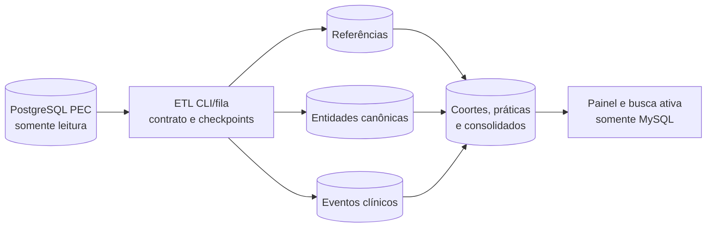

# Arquitetura de Dados do Monitora Fácil

## 1. Objetivo

O MySQL é a base operacional e analítica do Monitora Fácil. O PostgreSQL do e-SUS APS PEC é uma fonte somente leitura, acessada exclusivamente por comandos e filas em segundo plano.

O painel web nunca consulta o PEC. Cada sincronização extrai apenas os campos necessários, normaliza os registros no MySQL e recalcula os produtos analíticos. O desenho deve permitir busca ativa por cidadão, auditoria das regras e reconstrução dos resultados quando uma nota metodológica mudar.

Este documento separa:

1. fatos e dimensões extraídos do DW PEC;
2. entidades canônicas mantidas no MySQL;
3. resultados derivados para indicadores e vigilância;
4. controle técnico das sincronizações.

As tabelas das seções 3 a 6 são o desenho-alvo. As tabelas já existentes estão identificadas na seção 2. Nenhuma tabela proposta deve ser criada antes da inspeção do esquema real disponível na VPS.

## 2. Estado atual

| Tabela | Estado | Finalidade |
|---|---|---|
| `users` | existente | usuários administradores |
| `settings` | existente | configurações globais do município |
| `consolidation_teams` | existente | totais de equipes por quadrimestre e tipo |
| `consolidation_registrations` | existente | totais MICI e MICDT por quadrimestre |
| `sync_logs` | existente | início, término, situação e erro das sincronizações |
| `family_health_indicator_snapshots` | existente | resultado quadrimestral agregado por equipe e indicador |
| `family_health_monthly_snapshots` | existente | resultado mensal agregado por equipe e indicador |
| `c2_cohort_snapshots` | existente | coorte C2 agregada por equipe e quadrimestre |

Os snapshots atuais atendem aos painéis agregados de C1 e C2. Eles não preservam a evidência por cidadão e por boa prática necessária para busca ativa, reprocessamento de C3 a C7, duplicidade e vigilância.

## 3. Princípios do desenho-alvo

### 3.1. Quatro camadas locais

| Camada | Prefixo | Conteúdo | Regra |
|---|---|---|---|
| Referência | `ref_` | CBO, CIAP, CID, procedimentos, imunobiológicos e domínios | cópia pequena e versionada das dimensões usadas |
| Canônica | nomes de negócio | cidadãos, equipes, unidades, profissionais, famílias, vínculos e condições | estado atual com histórico de vigência quando necessário |
| Eventos | sufixo `_events` e tabelas-filhas | fichas e fatos clínicos relevantes | preserva a evidência mínima, sem copiar o PEC inteiro |
| Produtos analíticos | prefixo `indicator_` e sufixo `_results` | coortes, práticas, notas, vigilância e consolidados | sempre recalculável a partir das camadas anteriores |

### 3.2. Regras obrigatórias

- PostgreSQL somente leitura e apenas em CLI, fila ou tarefa agendada.
- MySQL como única fonte das requisições web.
- Chaves do PEC armazenadas como identificadores de origem, sem pressupor que sejam estáveis entre instalações ou versões.
- Toda linha extraída registra `source_system`, `source_key`, `source_version`, `extracted_at` e, quando disponível, `source_updated_at`.
- Resultados guardam `calculation_version`, data de corte, período, origem das evidências e condição de prévia ou resultado fechado.
- Nenhum resultado local deve ser chamado de oficial. Siaps, SCNES e RNDS podem conter dados ou regras de vínculo ausentes no DW local.
- Falha de extração ou incompatibilidade de esquema preserva o último lote válido.
- Dados pessoais e clínicos são minimizados; CPF, CNS, telefones e endereço exigem criptografia, hash para pesquisa e bloqueio em logs.

## 4. Tabelas propostas

### 4.1. Controle da integração

#### `etl_runs`

Uma execução completa ou parcial do ETL.

- `id`
- `scope` (`references`, `citizens`, `events`, `indicators`, `all`)
- `status` (`running`, `success`, `failed`, `partial`)
- `source_version`
- `schema_fingerprint`
- `cutoff_at`
- `started_at`, `finished_at`
- `rows_read`, `rows_written`, `rows_rejected`
- `error_summary`

O `sync_logs` atual deve ser migrado ou ampliado para assumir esse contrato, evitando dois históricos concorrentes.

#### `etl_checkpoints`

Controla a última chave, competência ou data processada por conjunto de origem.

- `source_name`
- `cursor_type`
- `cursor_value`
- `last_successful_run_id`
- `updated_at`

#### `etl_rejections`

Registros rejeitados sem interromper um lote inteiro quando a rejeição puder ser isolada.

- `etl_run_id`
- `source_name`, `source_key`
- `reason_code`, `reason_detail`
- `payload_fingerprint`

### 4.2. Referências

- `ref_cbos`
- `ref_ciaps`
- `ref_cids`
- `ref_procedures`
- `ref_immunobiologicals`
- `ref_domain_values`

Cada referência deve manter código, descrição, situação, vigência e identificador da dimensão do PEC. As listas normativas de CBO, CIAP, CID, ABP, SIGTAP, vacina, dose, estratégia e motivo da visita devem ter versão própria; não devem ficar dispersas em SQL ou componentes Livewire.

### 4.3. Território e pessoas

#### `health_units`

- CNES, nome, município, situação e vigência.

#### `teams`

- INE, tipo de equipe, nome, CNES da unidade, situação, carga horária quando disponível e vigência.

#### `professionals`

- chave local, CNS criptografado, hash do CNS, CBO atual e vínculos de equipe/unidade com vigência.

#### `citizens`

Registro canônico usado pelo Monitora Fácil.

- `id`
- nome e nome social criptografados
- data de nascimento
- sexo e identidade de gênero, quando disponíveis e necessários à regra
- CPF e CNS criptografados
- `cpf_hash`, `cns_hash` e chave de identidade para busca e deduplicação
- situação de óbito/saída e datas conhecidas
- `canonical_status`

#### `citizen_source_records`

Relaciona um cidadão canônico às diferentes representações no PEC, cadastro individual e fichas.

- `citizen_id`
- `source_name`, `source_key`
- qualidade da identificação
- primeira e última observação
- situação atual

#### `citizen_duplicate_candidates`

Fila auditável de possíveis duplicidades, com regra, pontuação, situação e decisão humana.

#### `citizen_merge_events`

Histórico imutável de unificações e reversões. A visão “Cidadão PEC após duplicados” será uma consulta sobre `citizens` e esses relacionamentos, sem uma terceira cópia do cidadão.

#### `citizen_team_links`

- `citizen_id`, `team_id`, `health_unit_id`
- microárea
- início e fim da vigência
- tipo e origem do vínculo
- regra de desempate aplicada
- `is_current`

O vínculo atual pode ser alimentado pela visão `tb_acomp_cidadaos_vinculados`; avaliações históricas precisam conservar a equipe vigente na data de corte.

#### `households`, `families` e `family_memberships`

Representam domicílio, família e participação do cidadão com vigência. A fonte exata deve ser validada no PEC da VPS, pois tabelas auxiliares de relatórios operacionais estão sinalizadas para futura descontinuação na documentação do DW.

#### `citizen_conditions`

Condições com código CIAP, CID ou ABP, situação, início, resolução, origem e evidência. Condições autorreferidas do cadastro individual e problemas clínicos avaliados no atendimento devem permanecer distinguíveis.

### 4.4. Eventos mínimos

| Tabela local | Conteúdo mínimo | Fonte funcional do DW |
|---|---|---|
| `individual_registration_events` | cadastro, saída, recusa, condições autorreferidas e equipe | Cadastro Individual |
| `household_registration_events` | domicílio, endereço necessário, recusa e responsável | Cadastro Domiciliar/Territorial |
| `individual_care_events` | cidadão, data, equipe, unidade, profissional, CBO, tipo de atendimento, modalidade, medidas | Atendimento Individual |
| `individual_care_problems` | CIAP/CID/ABP e situação do problema | problemas/condições do Atendimento Individual |
| `individual_care_procedures` | procedimentos solicitados, avaliados ou executados | procedimentos do Atendimento Individual |
| `dental_care_events` | atendimento odontológico, profissional, equipe, desfecho e medidas necessárias | Atendimento Odontológico Individual |
| `dental_care_problems` | condições avaliadas no atendimento odontológico | problemas odontológicos |
| `dental_care_procedures` | procedimentos odontológicos | procedimentos odontológicos |
| `procedure_events` | atendimento de procedimento, cidadão, data, equipe, profissional e CBO | Procedimentos |
| `procedure_event_items` | código SIGTAP e quantidade | itens de Procedimentos |
| `collective_activity_events` | atividade, prática, público-alvo, data, equipe e profissionais | Atividade Coletiva |
| `collective_activity_participants` | cidadão identificado e participação | participantes de Atividade Coletiva |
| `food_consumption_events` | marcadores aplicáveis, cidadão, data, equipe e profissional | Consumo Alimentar |
| `home_visit_events` | cidadão, data, equipe, profissional, CBO, motivo e desfecho | Visita Domiciliar e Territorial |
| `vaccination_events` | atendimento, cidadão, data, equipe e profissional | Vacinação |
| `vaccination_doses` | imunobiológico, dose, estratégia, lote, fabricante e data de aplicação | vacinas aplicadas |

Os nomes físicos e colunas de origem serão vinculados somente após o inventário por `information_schema` na VPS. Já estão confirmados no projeto e na documentação, entre outros, `tb_fat_atendimento_individual`, `tb_fat_vacinacao`, `tb_fat_vacinacao_vacina`, `tb_fat_visita_domiciliar` e `tb_acomp_cidadaos_vinculados`.

PSE deve ser uma classificação da atividade coletiva e de seus participantes. Não requer uma cópia paralela da mesma ficha.

### 4.5. Produtos analíticos

#### `indicator_runs`

Identifica um cálculo, versão das regras, data de corte, período, fonte e estado de fechamento.

#### `indicator_cohort_memberships`

Registra por que uma pessoa entrou ou saiu de uma coorte, equipe atribuída e janela de avaliação.

#### `indicator_person_results`

Uma linha por cidadão, indicador, equipe e período, com elegibilidade, pontuação total, máximo aplicável e estado da avaliação.

#### `indicator_practice_results`

Uma linha por cidadão e prática A–K, contendo:

- `practice_code`
- `eligible`
- `achieved`
- `points_earned`, `points_possible`
- `evidence_count`
- primeira e última evidência
- referências aos eventos que justificam o resultado
- motivo estruturado de pendência ou exclusão

Esse formato atende às cinco práticas do C2, às onze práticas do C3, às práticas do C4–C6 e aos quatro denominadores específicos do C7.

#### `indicator_team_monthly_results` e `indicator_team_quarterly_results`

Consolidados por CNES/INE. As tabelas existentes `family_health_monthly_snapshots` e `family_health_indicator_snapshots` devem ser migradas para esse contrato sem perda de histórico.

#### `indicator_forecasts`

Prévia separada do resultado observado. Suporta C2 nos próximos seis quadrimestres e C3 nos próximos três, com `forecast_horizon`, data de corte e hipóteses explícitas.

#### Outros produtos

- `territory_period_results`: Vínculo e Acompanhamento por mês/quadrimestre e microárea.
- `oral_health_period_results`: resultado de Saúde Bucal.
- `emulti_period_results`: resultado de e-Multi.
- `surveillance_case_results`: sífilis, hanseníase e tuberculose, mantendo regra e evidências.
- `child_vaccination_results`: situação vacinal por criança, esquema e data de corte.

“Processa meses” e “Processa quadrimestres” são rotinas de orquestração sobre `etl_runs`, calendário e produtos analíticos; não são tabelas de domínio.

## 5. Mapeamento da lista funcional

| Solicitação | Destino recomendado |
|---|---|
| CBO, CIAP e CID | `ref_cbos`, `ref_ciaps`, `ref_cids` |
| Atendimento individual, odontológico, procedimentos, atividade coletiva, consumo alimentar, visita e vacinação | tabelas de eventos normalizadas |
| Cadastro individual e domiciliar | eventos de cadastro e estado canônico derivado |
| Cidadãos e Cidadão PEC | `citizens` + `citizen_source_records` |
| Unificação e duplicados | candidatos + histórico de unificação, sem duplicar a tabela canônica |
| Cidadão PEC após duplicados | visão do cidadão canônico |
| Condições ativas | `citizen_conditions`, distinguindo cadastro e avaliação clínica |
| Vínculo, microáreas, famílias, unidades e equipes | entidades canônicas com vigência |
| Processamento CNES | `health_units`, `teams` e registro em `etl_runs` |
| PSE | recorte das atividades coletivas e participantes |
| QSF C1–C7 mensal/quadrimestral | coorte, resultado por pessoa, prática e consolidado por equipe |
| Previsões C2/C3 | `indicator_forecasts` |
| Saúde Bucal, e-Multi e consolidados | produtos analíticos por período |
| Vigilâncias e vacinação infantil | produtos específicos derivados dos mesmos eventos clínicos |

## 6. Requisitos normativos C1–C7

| Indicador | Dados indispensáveis | Particularidade que o modelo deve preservar |
|---|---|---|
| C1 | atendimento individual, tipo de demanda, CBO, CNS profissional, identificação do cidadão, CNES/INE | numerador 1/2; denominador 1/2/4/5/6; média dos quatro meses |
| C2 | vínculo, nascimento, consultas, antropometria, visitas e doses de vacina | coorte de quem completa dois anos; cinco práticas e exceção de visita para eAP |
| C3 | gestação, DUM/DPP, consultas, PA, antropometria, visitas, exames, dTpa, puerpério e saúde bucal | onze práticas; janelas gestacionais e puerperais; desfecho e exclusões |
| C4 | condição ativa de diabetes, consultas, PA, antropometria, visitas, HbA1c e exame dos pés | janelas de 6 e 12 meses; condição ativa e resolvida distinguíveis |
| C5 | condição ativa de hipertensão, consultas, PA, antropometria e visitas | janelas de 6 e 12 meses; condição ativa e resolvida distinguíveis |
| C6 | idade, vínculo, consultas, antropometria, visitas e influenza | idade mínima de 60 anos e janela anual |
| C7 | idade, sexo/identidade de gênero, rastreamento cervical, HPV, saúde sexual/reprodutiva e mama | quatro populações e denominadores próprios, com pesos 20/30/30/20 |

As notas usam dados enviados ao Siaps e, em vários indicadores, informações de SCNES e RNDS. Portanto, o cálculo local deve exibir `estimativa local`, `prévia` ou `fechado localmente`, além da data de corte. Aferição oficial exige comparação amostral com o Siaps.

## 7. Estratégia de sincronização

1. **Inventariar:** registrar versão do PEC, tabelas, colunas, tipos, índices e contagens na VPS.
2. **Validar contrato:** abortar de forma segura se faltar tabela ou coluna obrigatória.
3. **Extrair:** ler em páginas, por chave/data/competência, com usuário PostgreSQL somente leitura.
4. **Carregar estágio:** gravar lote temporário e validar contagem, chaves e integridade.
5. **Publicar:** fazer `upsert` transacional no MySQL e marcar registros que deixaram de existir nas visões correntes.
6. **Calcular:** reconstruir coortes e práticas afetadas pela janela reprocessada.
7. **Consolidar:** gerar resultados mensais, quadrimestrais e previsões.
8. **Auditar:** armazenar versão da regra, data de corte, contagens, rejeições e duração.

Visões de estado atual, como cidadão vinculado, exigem carga completa ou comparação de hash. Fatos históricos podem usar carga incremental, com releitura móvel das competências recentes para absorver correções tardias.

## 8. Índices e retenção

Índices mínimos:

- eventos: `(citizen_id, event_date)`, `(team_id, event_date)`, `(source_name, source_key)`;
- condições: `(citizen_id, status, onset_date)` e códigos CIAP/CID/ABP;
- vínculos: `(citizen_id, valid_from, valid_to)` e `(team_id, is_current)`;
- resultados: `(indicator_code, period_start, period_end, team_id)` e `(citizen_id, indicator_code)`;
- referências: código normalizado e vigência.

Eventos antigos não devem ser excluídos enquanto forem necessários às maiores janelas das regras vigentes, à reavaliação histórica ou à auditoria. A política definitiva de retenção e anonimização deve ser aprovada antes da carga nominal.

## 9. Fontes técnicas

- [DW e-SUS APS PEC](https://integracao.esusaps.bridge.ufsc.tech/dw/)
- [Tabelas fato](https://integracao.esusaps.bridge.ufsc.tech/dw/fatos/index.html)
- [Dimensões](https://integracao.esusaps.bridge.ufsc.tech/dw/dimensoes/index.html)
- [Visualizações](https://integracao.esusaps.bridge.ufsc.tech/dw/visualizacoes/index.html)
- [Acompanhamento de cidadãos vinculados](https://integracao.esusaps.bridge.ufsc.tech/dw/visualizacoes/acompanhamento_cidadaos_vinculados.html)
- Notas Metodológicas C1 a C7 e Nota Técnica de avaliação quadrimestral armazenadas em `importacao/referencia/`.

O arquivo local `NT_06-2025_cvat-avaliacao-do-quadrimestre.pdf` contém a Nota Técnica nº 8/2026-DEAPS/SAPS/MS. O número interno do documento, e não o nome legado do arquivo, deve identificar a regra implementada.
