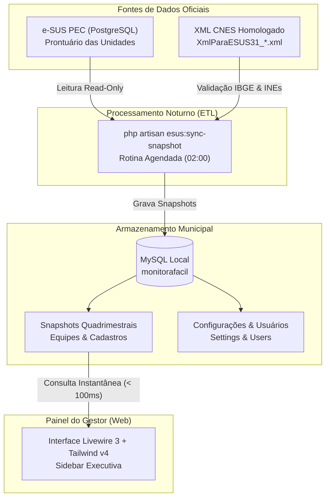

# Monitora Fácil (Saúde Brasil 360)

> **Plataforma Municipal de Gestão, Monitoramento e Projeção Financeira da Atenção Primária à Saúde (APS)**

[](https://laravel.com)
[](https://php.net)
[](https://livewire.laravel.com)
[](https://tailwindcss.com)
[](https://mysql.com)
[](https://sisaps.saude.gov.br/esus/)
[](#testes-automatizados)

---

## 📌 Sumário

- [Visão Geral](#-visão-geral)
- [Arquitetura e Princípios Técnicos](#-arquitetura-e-princípios-técnicos)
- [Funcionalidades Principais](#-funcionalidades-principais)
- [Estrutura do Projeto](#-estrutura-do-projeto)
- [Stack Tecnológica & Requisitos](#-stack-tecnológica--requisitos-do-sistema)
- [Instalação e Configuração](#-instalação-e-configuração)
- [Comandos Artisan e Processamento DW](#-comandos-artisan-personalizados)
- [Variáveis de Ambiente (.env)](#-variáveis-de-ambiente-env)
- [Rotinas de Sincronização e Agendamento](#-rotinas-de-sincronização-e-agendamento)
- [Testes Automatizados](#-testes-automatizados)
- [Servidores MCP e RAG Normativo](#-servidores-mcp-model-context-protocol)
- [Guia de Deploy (Hostinger + CloudPanel)](deploy.md)
- [Licença](#-licença)

---

## 🎯 Visão Geral

O **Saúde Brasil 360 Monitor** é uma aplicação gerencial desenvolvida para apoiar Secretarias Municipais de Saúde no acompanhamento contínuo dos indicadores da Atenção Primária sob o modelo de cofinanciamento federal da APS (Saúde Brasil 360), alinhado à **Nota Técnica nº 30/2025 - CGESCO/DESCO/SAPS/MS**.

A plataforma opera no modelo **Single-Tenant**, com banco de dados isolado e customização por município (*white-label*), consolidando dados do prontuário eletrônico **e-SUS PEC** e dos arquivos oficiais de homologação do **CNES** sem interferir na operação das unidades básicas de saúde.

---

## 🏛 Arquitetura e Princípios Técnicos



### Princípios Fundamentais

1. **Zero Impacto no e-SUS PEC**: O painel web nunca realiza consultas diretas no PostgreSQL de produção do e-SUS. Todas as páginas consultam apenas o MySQL local, garantindo tempo de resposta instantâneo e eliminando qualquer risco de lentidão nas salas de atendimento médico ou de enfermagem.
2. **Leitura Estritamente Segura (Read-Only)**: O acesso ao banco do e-SUS ocorre por meio de credenciais com permissão exclusiva de leitura (`SELECT`).
3. **Consolidação em Snapshots Quadrimestrais**: Os dados são agregados por ano e competência quadrimestral (1º, 2º e 3º quadrimestre), mantendo o histórico inalterado para auditoria e planejamento.

---

## ✨ Funcionalidades Principais

### 1. 🧭 Sidebar Executiva e Navegação Rápida
- Barra lateral fixa no desktop com tema escuro executivo (`#0c1f1c`) e detalhes em degradê esmeralda.
- Indicador pulsante em tempo real da conexão com a base do e-SUS PEC e fuso horário municipal (`America/Maceio`).
- Atalhos de rolagem suave (`#equipes`, `#cadastros`, `#simulador`).
- Drawer deslizante responsivo com animação e controle via Alpine.js para smartphones e tablets.

### 2. 👥 Estrutura Assistencial (Equipes Homologadas)
- Leitura automatizada do XML de homologação ministerial do CNES.
- Contabilização das equipes ativas categorizadas em:
  - **eSF**: Equipes de Saúde da Família.
  - **eSB**: Equipes de Saúde Bucal (40h, 30h, etc.).
  - **eMulti**: Equipes Multiprofissionais (Ampliadas, Complementares e Estratégicas).
- Totalizador consolidado e tratamento visual diferenciado entre zero homologado e ausência de consolidação.

### 3. 📋 Vínculo e Território (Situação dos Cadastros)
- Monitoramento de cadastros territoriais segundo a regra de atualização nos últimos **24 meses**:
  - **MICI**: Cadastros Individuais (Atualizados vs Desatualizados).
  - **MICDT**: Cadastros Domiciliares e Territoriais / Domicílios (Atualizados vs Desatualizados).
- Exibição de totais absolutos e percentual de cobertura territorial atualizada.

### 4. 🩺 Componente de Qualidade e Busca Ativa (C1 a C7 & CVAT)

Acompanhamento detalhado dos indicadores clínicos por faixas de desempenho (*Ótimo*, *Bom*, *Suficiente*, *Regular*) e listas nominais completas para busca ativa em tempo real:

- **C1 · Mais Acesso na APS**: Monitora a proporção de atendimentos individuais por demanda programada (numerador: tipos 1 e 2; denominador: tipos 1, 2, 4, 5 e 6) para equipes eSF e eAP, considerando os 7 CBOs definidos na nota metodológica. A média dos 4 meses consolida a estimativa municipal.
- **C2 · Cuidado no Desenvolvimento Infantil**: Coorte de crianças que completam 2 anos no quadrimestre. Busca ativa nominal avaliando 5 boas práticas (A: 9 consultas médicas/enfermagem, B: antropometria peso e altura, C: vacina VIP, D: vacina Penta, E: vacina Pneumo-10).
- **C3 · Cuidado na Gestação e Puerpério**: Acompanhamento nominal de gestantes e puérperas com base na DUM/DPP e janela de até 42 semanas / 42 dias puerperais. Rastreia 11 boas práticas clínicas (A a K: captação precoce, 6 consultas, exames de sífilis/HIV/urina, PA, atendimento odontológico, vacina dTpa, puerpério e visitas domiciliares).
- **C4 · Cuidado da Pessoa com Diabetes**: Coorte e lista nominal de pessoas com diagnóstico ativo de diabetes (códigos CIAP-2 e CID-10). Rastreia as 6 boas práticas do Quadro 01: consulta médica/enfermagem no semestre (20 pts), PA no semestre (15 pts), antropometria anual (15 pts), visitas ACS com intervalo mínimo de 30 dias (20 pts), exame de Hemoglobina Glicada HbA1c (15 pts) e Avaliação dos Pés nos últimos 12 meses (15 pts).
- **C5 · Cuidado da Pessoa com Hipertensão**: Coorte e lista nominal de hipertensos ativos. Rastreia as 4 boas práticas do Quadro 01: consulta semestral (25 pts), PA semestral (25 pts), antropometria anual (25 pts) e visitas domiciliares ACS anuais com intervalo >= 30 dias (25 pts).
- **C6 · Cuidado da Pessoa Idosa (60+ Anos)**: Coorte e lista nominal de idosos vinculados. Rastreia as 4 boas práticas do Quadro 01: consulta médica/enfermagem anual (25 pts), antropometria anual (25 pts), visitas ACS anuais (25 pts - com regra normalizada para eAP 76) e vacinação contra Influenza anual (25 pts).
- **C7 · Cuidado da Saúde da Mulher**: Rastreamento nominal nos 4 estratos populacionais do Quadro 01: Prática A (citopatológico 25-64 anos, peso 20), Prática B (vacina HPV 9-14 anos, peso 30), Prática C (saúde sexual e reprodutiva 14-69 anos, peso 30) e Prática D (mamografia de rastreamento 50-69 anos, peso 20).
- **CVAT · Avaliação Territorial e Vínculo (Portaria GM/MS & NT nº 8/2026)**:
  - Avaliação do Componente II (Vínculo e Acompanhamento Territorial): Nota de Cadastro (0 a 3,00), Nota de Acompanhamento (0 a 7,00), Nota Final (0 a 10,00) e classificação oficial (*Ótimo*, *Bom*, *Suficiente*, *Regular*).
  - Relação nominal completa para saneamento de cadastros (MICI, MICDT, vinculação com equipe) e busca ativa de pessoas em vulnerabilidade prioritária (crianças, idosos, beneficiários do BPC e Bolsa Família/PBF).
  - Distribuição analítica de equipes por faixas de qualidade e parâmetros populacionais.
- **Saúde Bucal (B1 a B6) e e-Multi (M1 e M2)**: Monitoramento assistencial dos componentes odontológico e multiprofissional.


### 5. 💲 Simulador de Repasses e Planejamento Financeiro
- Ferramenta de estimativa do componente de **Vínculo e Acompanhamento Territorial** de eSF (40h).
- Simulação interativa baseada nas 4 faixas de desempenho da Nota Técnica 30/2025:
  - **Ótimo**: R$ 18.000,00 / mês por equipe.
  - **Bom**: R$ 13.500,00 / mês por equipe.
  - **Suficiente**: R$ 9.000,00 / mês por equipe.
  - **Regular**: R$ 4.500,00 / mês por equipe.
- Botão de atalho rápido *"Todas em Bom"*.
- Cálculo instantâneo do valor bruto mensal e da projeção para as 4 parcelas do quadrimestre.
- Alertas visuais e validação em tempo real para garantir que o número de equipes distribuídas seja exatamente igual ao total homologado.

### 6. 🔐 Acesso e Segurança
- Autenticação restrita ao gestor/administrador municipal.
- Proteção contra força bruta (*Rate Limiting* integrado ao `LoginRequest`).
- Sessões protegidas no banco de dados e hash Bcrypt com fator de custo 12.
- Registro detalhado de execuções de sincronização na tabela `sync_logs`.

---

## 📁 Estrutura do Projeto

```
monitorafacil/
├── app/
│   ├── Console/
│   │   └── Commands/
│   │       ├── EsusSyncSnapshot.php      # ETL de consolidação noturna do PEC e XML
│   │       └── ResetAdminPassword.php    # Utilitário CLI para redefinição de senha
│   ├── Enums/
│   │   ├── SyncStatus.php                # Status da sincronização (success, failed, running)
│   │   └── TeamType.php                  # Tipos de equipe (esf, esaude_bucal, emulti)
│   ├── Http/
│   │   ├── Controllers/Auth/             # Autenticação de sessões do gestor
│   │   └── Requests/Auth/LoginRequest.php# Validação e rate limiting de login
│   ├── Livewire/Dashboard/
│   │   ├── FinancialSimulator.php        # Lógica reativa do simulador financeiro
│   │   ├── QualityOverview.php           # Painel de indicadores C1-C7, B1-B6 e M1-M2
│   │   ├── QuarterSelector.php           # Seletor global de ano e quadrimestre
│   │   ├── RegistrationsOverview.php     # Cards de cadastros MICI e MICDT
│   │   └── TeamsOverview.php             # Indicadores de equipes homologadas
│   ├── Models/                           # Modelos Eloquent (User, Setting, Consolidation, etc.)
│   └── Services/                         # Regras de negócio (Cálculos financeiros, Snapshots, Settings)
├── config/
│   ├── bootstrap_admin.php               # Parâmetros padrão do usuário gestor inicial
│   └── esus.php                          # Caminho do XML homologado e fuso horário
├── database/
│   ├── migrations/                       # Esquemas das tabelas locais no MySQL
│   └── seeders/                          # Seeders de configuração inicial e admin
├── importacao/                           # Repositório de arquivos XML CNES municipais
├── lang/
│   └── pt_BR/                            # Localização completa em Português do Brasil
├── resources/
│   ├── css/app.css                       # Design System em Tailwind CSS v4
│   └── views/
│       ├── layouts/app.blade.php         # Layout principal com a Sidebar Executiva
│       ├── livewire/dashboard/           # Componentes Blade reativos do painel
│       └── dashboard.blade.php           # Visão geral do painel municipal
├── routes/
│   ├── web.php                           # Rotas da interface web
│   └── console.php                       # Agendamento de comandos cron
└── tests/                                # Testes automatizados (Unitários e de Funcionalidade)
```

---

## 💻 Stack Tecnológica & Requisitos do Sistema

### Stack em Uso
| Camada | Tecnologia | Versão em Uso |
| :--- | :--- | :--- |
| **Framework Backend** | [Laravel](https://laravel.com) | **v13.32.0** (Laravel 13.x) |
| **Ambiente PHP** | [PHP](https://php.net) | **v8.5.0** (requisito mínimo `>= 8.2`) |
| **Camada Reativa** | [Livewire](https://livewire.laravel.com) | **v3.8.9** |
| **Engine Interativa** | [Alpine.js](https://alpinejs.dev) | **v3.x** |
| **Design & CSS** | [Tailwind CSS](https://tailwindcss.com) | **v4.0.0** |
| **Build & Tooling** | [Vite](https://vitejs.dev) | **v6.2.0** |
| **Banco Local (App)** | [MySQL](https://mysql.com) | **>= 8.0** |
| **Banco e-SUS PEC** | [PostgreSQL](https://www.postgresql.org) | **>= 9.6** (acesso somente leitura) |
| **Gerenciador de Pacotes**| [Composer](https://getcomposer.org) / [NPM](https://npmjs.com) | **Composer >= 2.x** / **Node >= 18.x** |

### Extensões PHP Requeridas
- `pdo_mysql`, `pdo_pgsql`, `xml`, `xmlreader`, `mbstring`, `bcmath`, `curl`, `opcache`.

---

## 🚀 Instalação e Configuração

### 1. Clonar o repositório e acessar a pasta

```bash
git clone <url-do-repositorio> monitorafacil
cd monitorafacil
```

### 2. Instalar as dependências de backend e frontend

```bash
composer install
npm install
```

### 3. Configurar o arquivo `.env`

Copie o arquivo de exemplo:

```bash
cp .env.example .env
php artisan key:generate
```

Edite o `.env` informando as credenciais dos bancos:

```env
# Configurações do Sistema
APP_NAME="Saude Brasil 360 Monitor"
APP_ENV=local
APP_DEBUG=true
APP_URL=http://localhost:8000
APP_TIMEZONE=America/Maceio
APP_LOCALE=pt_BR
APP_FALLBACK_LOCALE=pt_BR
APP_FAKER_LOCALE=pt_BR

# Banco de Dados Local da Aplicação (MySQL)
DB_CONNECTION=mysql
DB_HOST=127.0.0.1
DB_PORT=3306
DB_DATABASE=monitorafacil
DB_USERNAME=root
DB_PASSWORD=

# Conexão com o e-SUS PEC da Prefeitura (PostgreSQL - Leitura)
ESUS_DB_HOST=192.168.2.50
ESUS_DB_PORT=5433
ESUS_DB_DATABASE=esus
ESUS_DB_USERNAME=esus_leitura
ESUS_DB_PASSWORD="sua_senha_leitura"
ESUS_DB_SCHEMA=public
ESUS_DB_SSLMODE=prefer

# Arquivo XML de Homologação CNES e Fuso Horário
ESUS_HOMOLOGATED_XML_PATH="importacao/XmlParaESUS31_270915.xml"
ESUS_SCHEDULE_TIMEZONE=America/Maceio

# Credenciais do Administrador Inicial
SEED_ADMIN_NAME="Administrador"
SEED_ADMIN_EMAIL="admin@monitorafacil.test"
SEED_ADMIN_PASSWORD="SuaSenhaForteAqui"
```

### 4. Executar as migrações e seeders

```bash
php artisan migrate --seed
```

### 5. Compilar os assets do frontend

Para ambiente de desenvolvimento:
```bash
npm run dev
```

Para ambiente de produção:
```bash
npm run build
```

### 6. Iniciar o servidor local

```bash
php artisan serve
```

Acesse no navegador: `http://127.0.0.1:8000`

---

## 🛠 Comandos Artisan Personalizados

### Inventário somente leitura do DW PEC

Antes de criar ou atualizar o espelho analítico no MySQL, gere o contrato real do esquema acessível pela VPS:

```bash
php artisan esus:inspect-schema
```

O comando abre uma transação PostgreSQL explicitamente somente leitura e grava em `storage/app/private/` um JSON com tabelas, colunas, tipos, índices e estimativas do catálogo. Nenhuma linha clínica ou identificação de cidadão é extraída. Um caminho alternativo pode ser informado com `--output=arquivo.json`.

### Sincronização e Processamento do DW PEC

Executa a leitura das tabelas do e-SUS PEC, cruza com as equipes ativas do XML homologado e processa indicadores agregados e listas nominais:

```bash
# Sincronização básica de consolidados e equipes:
php artisan esus:sync-snapshot

# Processamento analítico por escopo (C1 a C7, CVAT ou Geral):
php artisan esus:process-data --scope=all
php artisan esus:process-data --scope=c2 --year=2026 --quarter=3
php artisan esus:process-data --scope=c4 --year=2026 --quarter=3
php artisan esus:process-data --scope=cvat --year=2026 --month=12
```

### Ingestão da Base de Conhecimento RAG Local

Indexa os documentos regulamentares em `importacao/referencia/`, o `DATABASE-SCHEMA.md` e todas as migrations para consulta pelo servidor MCP `rag-service`:

```bash
node .agents/rag/ingest.js
```

### Gerenciamento de Senha do Administrador

Redefine a senha de um administrador existente ou gera uma senha forte de 16 caracteres automaticamente:

```bash
# Definir uma nova senha explicitamente:
php artisan admin:reset-password admin@monitorafacil.test --password="NovaSenhaSegura123!"

# Ou gerar uma senha segura aleatória:
php artisan admin:reset-password
```

---

## ⏰ Rotinas de Sincronização e Agendamento

O comando `esus:sync-snapshot` está configurado em `routes/console.php` para rodar automaticamente às **03:00** e `esus:process-data --scope=all` às **03:30**, no fuso horário configurado no município (`America/Maceio`). Os escopos específicos cobrem C1 a C7 e a relação nominal CVAT.

```php
Schedule::command('esus:sync-snapshot')
    ->dailyAt('03:00')
    ->timezone(config('esus.schedule_timezone'))
    ->withoutOverlapping();
```

### Em ambiente de Desenvolvimento:

```bash
php artisan schedule:work
```

### Em ambiente de Produção (Linux / Cron):

Adicione a seguinte entrada ao `crontab -e`:

```cron
* * * * * cd /caminho/para/o/monitorafacil && php artisan schedule:run >> /dev/null 2>&1
```

O botão **CVAT > Agendar extração** em *Configurações > Processar Dados* envia um job para a fila `database`; ele não consulta o PEC durante a requisição web. No servidor, mantenha um worker ativo. Confira o modelo em `scripts/monitorafacil-queue.service.example`:

```bash
sudo cp scripts/monitorafacil-queue.service.example /etc/systemd/system/monitorafacil-queue.service
sudo systemctl daemon-reload
sudo systemctl enable --now monitorafacil-queue.service
sudo systemctl status monitorafacil-queue.service
```

---

## 🧪 Testes Automatizados

A suíte de testes cobre fluxos de autenticação, integridade de snapshots, regras de negócio de C1 a C7, avaliação territorial CVAT, responsividade do layout e exportações CSV/PDF.

Para executar todos os testes:

```bash
php artisan test
```

Saída da suíte de validação:
```text
   PASS  Tests\Unit\ExampleTest
   PASS  Tests\Unit\FinancialProjectionServiceTest
   PASS  Tests\Feature\AuthenticationTest
   PASS  Tests\Feature\C2IndicatorTest
   PASS  Tests\Feature\C3IndicatorTest
   PASS  Tests\Feature\C4IndicatorTest
   PASS  Tests\Feature\C5IndicatorTest
   PASS  Tests\Feature\C6IndicatorTest
   PASS  Tests\Feature\C7IndicatorTest
   PASS  Tests\Feature\TerritorialBondingTest
   PASS  Tests\Feature\SettingsTest
   PASS  Tests\Feature\NominalTeamAndExportTest
   PASS  Tests\Feature\ResponsiveLayoutTest
   PASS  Tests\Feature\VersionControlTest

   Tests:    155 passed (1044 assertions)
   Duration: ~4.5 min
```

---

## 🤖 Servidores MCP e RAG Normativo

O projeto conta com integração ao padrão **Model Context Protocol (MCP)**, permitindo que agentes de IA e desenvolvedores inspecionem a base do e-SUS PEC, executem rotinas Artisan, validem arquivos e consultem semântica e léxica das regras normativas da APS e modelagens do banco de dados:

* **`postgres-esus-readonly`**: Consultas analíticas estritamente somente leitura no DW PostgreSQL do e-SUS PEC (`query`).
* **`laravel-artisan-runner`**: Execução controlada de comandos Artisan (`artisan_run`, `artisan_test`, `artisan_inspect_schema`).
* **`esus-file-validator`**: Validação de arquivos XML de homologação do CNES e leitura de cabeçalhos de relatórios CSV do SIAPS (`validate_esus_xml_structure`, `inspect_csv_headers_and_sample`).
* **`rag-service`**: Recuperação semântica e léxica híbrida (Dense Embeddings 384d + BM25) com isolamento estrito por indicador:
  * `search_aps_rules`: Busca trechos normativos oficiais das Notas Metodológicas C1 a C7, NT 08/2026 e NT 30/2025.
  * `search_db_schema`: Busca definições de tabelas, campos, índices e migrations em `database/migrations/` e `DATABASE-SCHEMA.md`.

👉 Para guia detalhado de ferramentas, políticas de segurança e instruções de configuração, consulte o arquivo [**MCP.md**](MCP.md).

---

## 📄 Licença

Software de uso restrito e gestão municipal da Atenção Primária à Saúde. Todos os direitos reservados.
